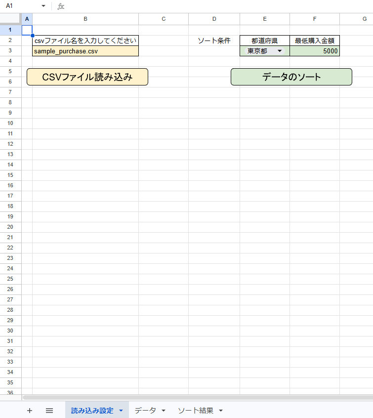
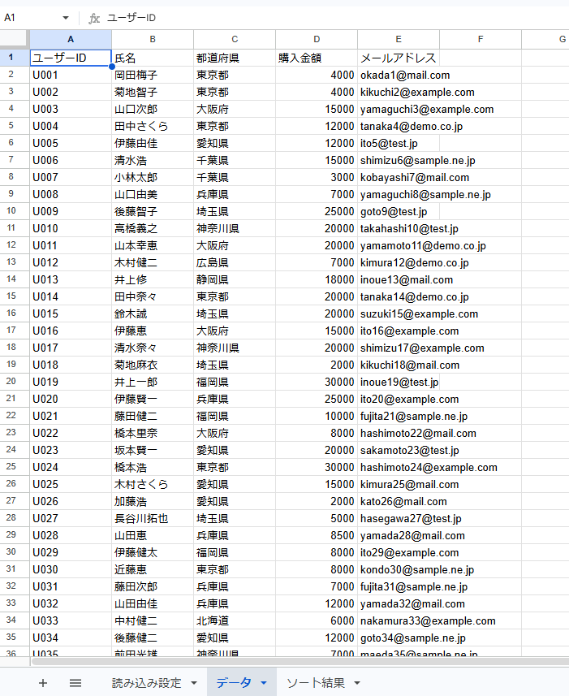
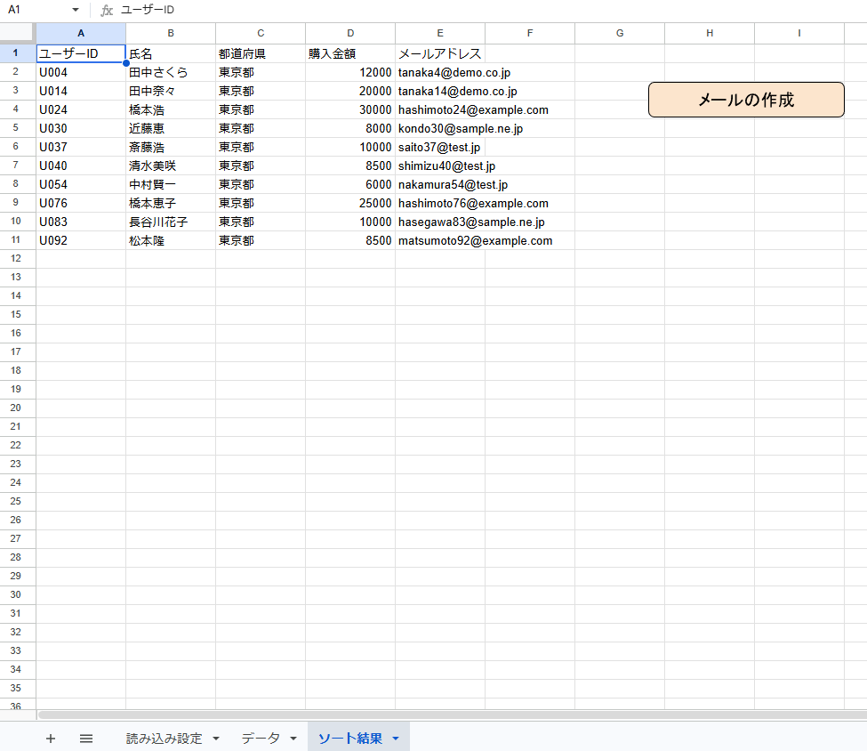
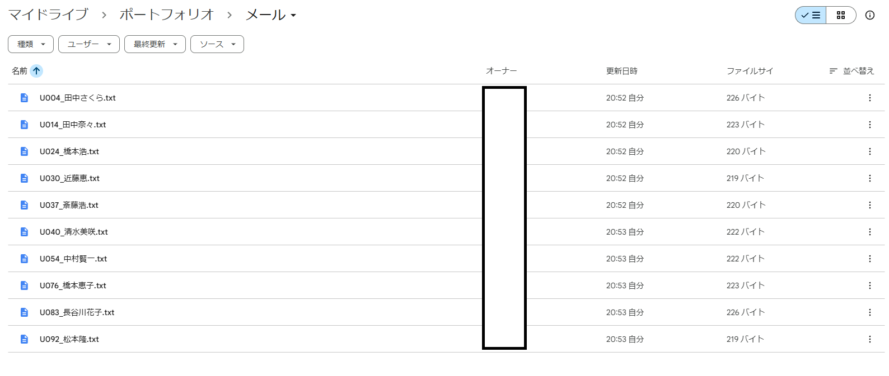
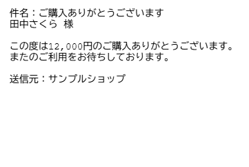

# GAS業務自動化ポートフォリオ｜CSV読み込み・データ抽出・メール文面自動生成

## 概要
Google Apps Script（GAS）を使用して、CSVデータの読み込みから
データの絞り込み、メール文面の自動生成までを一貫して自動化するツールです。

## できること
- CSVファイルの読み込みとスプレッドシートへの自動転記
- 都道府県・購入金額によるデータの絞り込み
- 絞り込み結果から1件につき1つのメール文面をテキストファイルとして自動生成

## 使用技術
- Google Apps Script
- Google スプレッドシート
- Google ドライブ

## 動作イメージ
### ①読み込み設定画面

### ②CSV転記後のデータシート

### ③絞り込み結果

### ④メールフォルダのファイル一覧

### ⑤テキストファイルの中身

## セットアップ手順
1. GoogleドライブにGAS用フォルダを作成
2. フォルダ内にGoogleスプレッドシートを新規作成
3. 同じフォルダにCSVファイルを配置
4. フォルダ内に「メール」フォルダを作成
5. スプレッドシートの「拡張機能」→「Apps Script」を開く
6. 「コード.gs」のコードをすべてコピー&ペースト
7. スプレッドシートに以下のシートを作成
   - 読み込み設定
   - データ
   - ソート結果
8. 読み込み設定シートのB3にCSVファイル名を入力
9. 以下のボタンを作成して各関数を紐付け
   - CSVファイル読み込み：importCSV関数
   - データのソート:：filterCSVData関数
   - メールの作成：createMail関数

## 工夫した点
- ヘッダー名で列を動的に検索するため、列順が変わっても正常に動作します
- CSVの拡張子（.csv）を未入力でも自動補完します
- 各処理にエラーハンドリングを実装し、問題発生時はポップアップで通知します
- メールフォルダが存在しない場合は自動で作成します

## 今後追加予定の機能
- 集計・レポート出力機能
- 実行日時の自動記録
